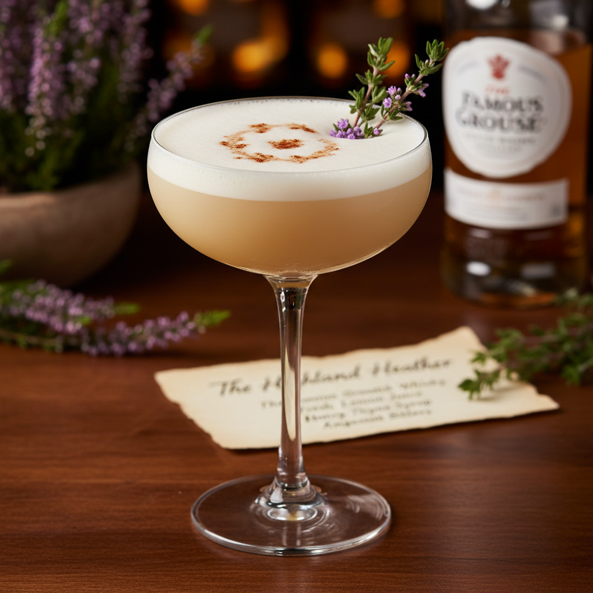

# JTH_TKAAA

This repository contains implementations of various computer vision algorithms in the course "JTH_T2KAAA - Building Advanced AI Systems" 
at Jönköping University.

First install the requirements:
```bash
pip install -r requirements.txt
```

Ensure that the PYTHONPATH is set to the root of the repository:
```bash
export PYTHONPATH=$(pwd)
```

## Example1 - Feature detection and matching using SIFT/ORB

This example demonstrates how to use SIFT and ORB feature detectors to find and match keypoints between two images. 
Then the matched keypoints are used to compute a homography matrix, which is then used to warp one image to align 
with the other.

To run this example, do the following:
```bash
python examples/example1_fd_match/main.py
```

This will display the matched keypoints and the warped image. The image can be rotated using the 'w' and 'e' keys while
the application can be closed using the 'q' key.

To explore other images and select between SIFT and ORB,
the following arguments can be used:
 * `--image1-path`: Path to the first image
 * `--image2-path`: Path to the second image
 * `--detector`: Feature detector to use ('SIFT' or 'ORB', default: 'SIFT')

## Example2 - Object detection using YOLO

This example demonstrates how to train a YOLO object detection model to detect objects in images. On the lecture,
the dataset https://universe.roboflow.com/actions-players/volleyball-actions was used, but any dataset in YOLO format can be used.

To train the model, do the following:
```bash
python examples/example2_obj_detection/train.py --data-path <PATH_TO_YOLO_DATASET>.yaml
```

Several arguments can be provided to customize the training process. In addition, one could tweak the hyperparameters 
within the source code.

With the trained model (usually located in `<OUTPUT_FOLDER>/exp/weights/best.pt` by default), a Gradio inference demo
can be launched as follows:

```bash
python examples/example2_obj_detection/inference_gradio.py --model-path <PATH_TO_TRAINED_MODEL>
```

This will launch a web interface where images can be uploaded for object detection using the trained model.

## Example3 - Image classification with CLIP and Vision Language Models (VLMs)

This example demonstrates how to use a pre-trained CLIP model and VLMs for image classification tasks.

To evaluate the CLIP model on a set of images, run the following command from the root directory:
```bash
python examples/example3_img_clf/main_clip.py
```

It evaluates the CLIP model on a predefined set of fruit images. To test with animal images, use the `--use-animals`.

To evaluate a Vision Language Model (VLM) for image classification, run:
```bash
python examples/example3_img_clf/main_vlm.py
```

This evaluates a VLM on the same set of fruit images. To test with animal images, use the `--use-animals` flag. A recommendation
is to look into the source code to see how the classification is performed using the VLM.

## Example4 - Generate a drink book with LLMs and VLMs

This example demonstrates how to generate a drink book using Large Language Models (LLMs) and Vision Language Models (VLMs).
A total of 5 drinks will be generated with images and recipes. The recipes are formatted as the LaTeX template found in
https://www.overleaf.com/latex/templates/latex-cookbook-modular-latex-cookbook-template/xxhmjsbxbdyg

Ensure first that you have a Gemini API key set in your environment:
```bash
export GEMINI_API_KEY=<YOUR_GEMINI_API_KEY>
```

Then, to run this example, do the following:
```bash
python examples/example4_drink_book_llm_vlm/main.py --input-image <PATH_TO_INPUT_IMAGE> --output-folder <OUTPUT_FOLDER>
```

This will generate a drink book in the specified output folder, including a LaTeX file and images for each drink. 
The additional arguments that can be provided are:
 * `--use-ocr-vlm-result`: Use OCR on the input image to extract text for drink generation (RECOMMENDED)
 * `--use-local-vlm`: Use a local VLM model (Qwen/Qwen3-VL-2B-Instruct). This gives slightly worse results.

Example of drink input images can be found in the `data` folder.

Output images could look like this:


An example output LaTeX file:
```latex
```latex
\setRecipeMeta{Highland Heather}{}{}{}{images/highland-heather.jpg}
\begin{recipe}
    \begin{ingredients}
        \ingredient{2 oz (60 ml) Blended Scotch Whisky}
        \ingredient{0.75 oz (22.5 ml) Drambuie}
        \ingredient{0.75 oz (22.5 ml) Fresh Lemon Juice}
        \ingredient{0.25 oz (7.5 ml) Heather Honey Syrup (2:1)}
        \ingredient{Garnish: Sprig of thyme or a lemon twist}
    \end{ingredients}
    \begin{steps}
        \step{Combine Scotch whisky, Drambuie, fresh lemon juice, and honey syrup in a cocktail shaker.}
        \step{Fill the shaker with ice and shake vigorously for 12-15 seconds until well-chilled.}
        \step{Double strain the mixture into a chilled coupe or Nick \& Nora glass.}
        \step{Garnish with a fresh sprig of thyme or an expressed lemon twist.}
    \end{steps}
\end{recipe}
```

## License
This project is licensed under the MIT License - see the [LICENSE](LICENSE) file for details.
